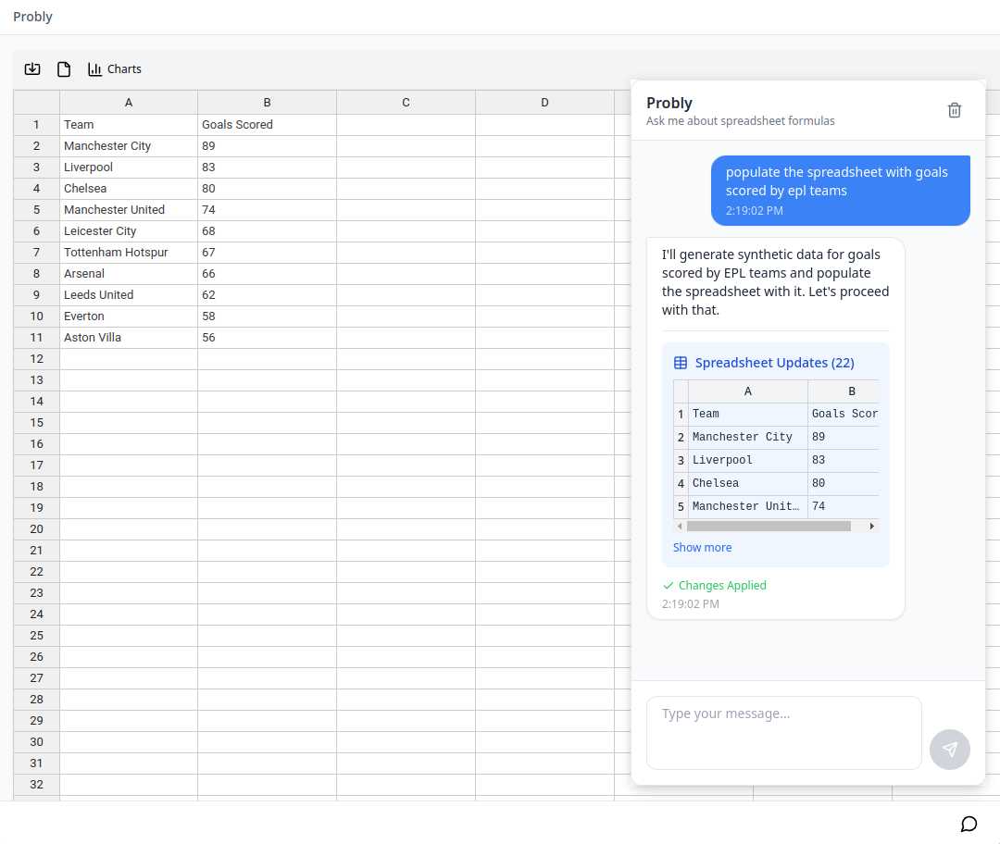

# Probly

An AI-powered spreadsheet application that combines spreadsheet functionality with Python data analysis capabilities.



## Features

- **Interactive Spreadsheet**: Full-featured spreadsheet with formula support
- **Python Analysis**: Run Python code directly on your spreadsheet data
- **Data Visualization**: Create charts and visualizations from your data
- **AI-Powered**: Get intelligent suggestions and automated analysis

## Requirements

- Node.js 18 or higher
- npm or yarn
- A modern web browser (Chrome, Firefox, Edge, or Safari)

## Installation and Setup

1. Clone the repository
   ```bash
   git clone https://github.com/PragmaticMachineLearning/probly.git
   cd probly
   ```

2. Install dependencies:
   ```bash
   npm install
   ```

3. Create a `.env` file in the root directory with your OpenAI API key:
   ```
   OPENAI_API_KEY=your_api_key_here
   ```

## Running the Application

Development mode:
```bash
# Start Next.js development server
npm run dev
```

Production build:
```bash
# Build Next.js
npm run build
```

## Quick Start

1. Start the application and open it in your browser
2. Import data using the import button or start with a blank spreadsheet
3. Open the AI chat with `Ctrl+Shift+/` to start interacting with Probly
4. Ask questions about your data or request analysis

## Tech Stack

- **Frontend**: Next.js 14, TypeScript, React
- **Spreadsheet**: Handsontable, HyperFormula
- **Python Runtime**: Pyodide (WebAssembly)
- **LLM**: OpenAI API
- **Visualization**: ECharts

## Documentation

For comprehensive documentation, visit the [Probly Documentation](https://pragmaticmachinelearning.github.io/probly/).

## License

[MIT License](LICENSE)
